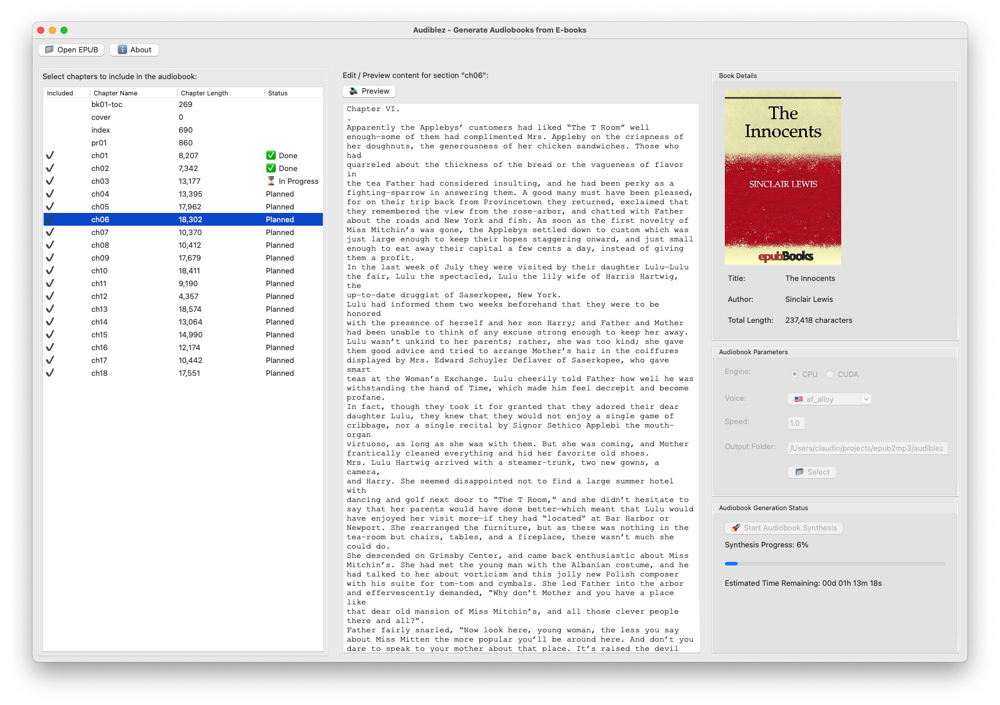

# Audiblez: Generate  audiobooks from e-books

[](https://github.com/santinic/audiblez/actions/workflows/pip-install.yaml)
[](https://github.com/santinic/audiblez/actions/workflows/git-clone-and-run.yml)


### v4 Now with Graphical interface, CUDA support, and many languages!



Audiblez generates `.m4b` audiobooks from regular `.epub` e-books,
using Kokoro's high-quality speech synthesis.

[Kokoro-82M](https://huggingface.co/hexgrad/Kokoro-82M) is a recently published text-to-speech model with just 82M params and very natural sounding output.
It's released under Apache licence and it was trained on < 100 hours of audio.
It currently supports these languages: 🇺🇸 🇬🇧 🇪🇸 🇫🇷 🇮🇳 🇮🇹 🇯🇵 🇧🇷 🇨🇳

On a Google Colab's T4 GPU via Cuda, **it takes about 5 minutes to convert "Animal's Farm" by Orwell** (which is about 160,000 characters) to audiobook, at a rate of about 600 characters per second.

On my M2 MacBook Pro, on CPU, it takes about 1 hour, at a rate of about 60 characters per second.

## How to install and run

If you have Python 3 on your computer, you can install it with pip.
You also need `espeak-ng` and `ffmpeg` installed on your machine:

```bash
sudo apt install ffmpeg espeak-ng python-wxgtk3.0-dev   # on Ubuntu/Debian 🐧
pip install audiblez
```

```python
brew install ffmpeg espeak-ng                           # on Mac 🍏
pip install audiblez
```

Then, to run the graphical interface, just type:

```bash
audiblez-ui
```

If you prefer the command-line instead, you can convert an .epub directly with:

```bash
audiblez book.epub -v af_sky
```

It will first create a bunch of `book_chapter_1.wav`, `book_chapter_2.wav`, etc. files in the same directory,
and at the end it will produce a `book.m4b` file with the whole book you can listen with VLC or any
audiobook player.
It will only produce the `.m4b` file if you have `ffmpeg` installed on your machine.

## Speed

By default the audio is generated using a normal speed, but you can make it up to twice slower or faster by specifying a speed argument between 0.5 to 2.0:

```bash
audiblez book.epub -v af_sky -s 1.5
```

## Supported Voices

Use `-v` option to specify the voice to use. Available voices are listed here.
The first letter is the language code and the second is the gender of the speaker e.g. `im_nicola` is an italian male voice.

| Language | Voices                                                                                                                                                                                                                                     |
|----------|--------------------------------------------------------------------------------------------------------------------------------------------------------------------------------------------------------------------------------------------|
| 🇺🇸     | `af_alloy`, `af_aoede`, `af_bella`, `af_heart`, `af_jessica`, `af_kore`, `af_nicole`, `af_nova`, `af_river`, `af_sarah`, `af_sky`, `am_adam`, `am_echo`, `am_eric`, `am_fenrir`, `am_liam`, `am_michael`, `am_onyx`, `am_puck`, `am_santa` |
| 🇬🇧     | `bf_alice`, `bf_emma`, `bf_isabella`, `bf_lily`, `bm_daniel`, `bm_fable`, `bm_george`, `bm_lewis`                                                                                                                                          |
| 🇪🇸     | `ef_dora`, `em_alex`, `em_santa`                                                                                                                                                                                                           |
| 🇫🇷     | `ff_siwis`                                                                                                                                                                                                                                 |
| 🇮🇳     | `hf_alpha`, `hf_beta`, `hm_omega`, `hm_psi`                                                                                                                                                                                                |
| 🇮🇹     | `if_sara`, `im_nicola`                                                                                                                                                                                                                     |
| 🇯🇵     | `jf_alpha`, `jf_gongitsune`, `jf_nezumi`, `jf_tebukuro`, `jm_kumo`                                                                                                                                                                         |
| 🇧🇷     | `pf_dora`, `pm_alex`, `pm_santa`                                                                                                                                                                                                           |
| 🇨🇳     | `zf_xiaobei`, `zf_xiaoni`, `zf_xiaoxiao`, `zf_xiaoyi`, `zm_yunjian`, `zm_yunxi`, `zm_yunxia`, `zm_yunyang`                                                                                                                                 |

## How to run on GPU

By default, audiblez runs on CPU. If you pass the option `--cuda` it will try to use the Cuda device via Torch.

Check out this example: [Audiblez running on a Google Colab Notebook with Cuda ](https://colab.research.google.com/drive/164PQLowogprWQpRjKk33e-8IORAvqXKI?usp=sharing]).

We don't currently support Apple Silicon, as there is not yet a Kokoro implementation in MLX. As soon as it will be available, we will support it.

## Manually pick chapters to convert

Sometimes you want to manually select which chapters/sections in the e-book to read out loud.
To do so, you can use `--pick` to interactively choose the chapters to convert (without running the GUI).


## Help page
For all the options available, you can check the help page `audiblez --help`:

```bash
usage: audiblez [-h] [-v VOICE] [-p] [-s SPEED] [-c] [-o FOLDER] epub_file_path

positional arguments:
  epub_file_path        Path to the epub file

options:
  -h, --help            show this help message and exit
  -v VOICE, --voice VOICE
                        Choose narrating voice: a, b, e, f, h, i, j, p, z
  -p, --pick            Interactively select which chapters to read in the audiobook
  -s SPEED, --speed SPEED
                        Set speed from 0.5 to 2.0
  -c, --cuda            Use GPU via Cuda in Torch if available
  -o FOLDER, --output FOLDER
                        Output folder for the audiobook and temporary files

example:
  audiblez book.epub -l en-us -v af_sky

to use the GUI, run:
  audiblez-ui
```

## Author

by [Claudio Santini](https://claudio.uk) in 2025, distributed under MIT licence.

